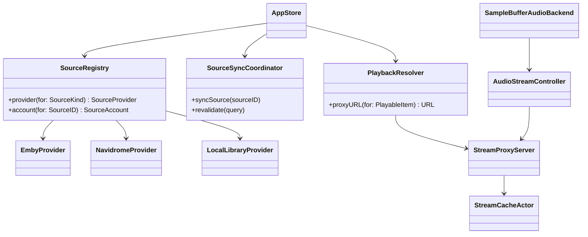

# Petrichor Emby / Navidrome Multi-Source Architecture

## 目标

在不推倒现有 `Petrichor` 架构的前提下，把当前“本地文件播放器”升级为“多源音乐客户端”：

- 本地文件夹继续保留。
- 新增 Emby 与 Navidrome(Subsonic API) 作为远端源。
- 播放链路切换为可流式、可预解码、支持 gapless 的 `AVSampleBufferAudioRenderer` 方案。
- UI 与同步层采用 MVI/Redux 风格状态管理，避免跨源状态不一致。

## 现状与直接痛点

当前实现对“本地文件”的假设非常强，主要集中在以下位置：

- `Models/Core/Track.swift` / `Models/Core/FullTrack.swift`
  - `url` 被假定为本地文件 URL。
- `Managers/PlaybackManager.swift`
  - `playTrack(_:)` 里直接做 `FileManager.default.fileExists(atPath:)`。
- `Core/AudioPlayer.swift`
  - 直接把 `URL` 交给 `SFBAudioEngine.AudioPlayer`。
- `Managers/Database/DMSetup.swift`
  - `tracks.folder_id` 是 `NOT NULL`。
  - `tracks.path` 是本地路径并且 `UNIQUE`。
- `Views/Library/LibraryView.swift`
  - 会把筛选结果一次性物化成 `[Track]`，对数万首歌的远端同步不够友好。

结论：Emby / Navidrome 不能只加一个 API client。必须一起改三层：

1. 数据模型从“文件路径”升级为“可解析媒体定位符”。
2. 播放从“直接播文件 URL”升级为“本地代理流 + 自有解码渲染”。
3. 列表与同步从“全量内存数组”升级为“SQLite 分页 + SWR”。

## 分阶段改造策略

建议不要一次性替换全栈，而是分 4 个阶段落地：

1. 引入 Source Abstraction、Source Account、SQLite 新 schema，但暂时保留现有 `SFBAudioEngine` 本地播放。
2. 引入 localhost 流式代理缓存、Emby/Navidrome 拉流与元数据同步。
3. 用新的 `SampleBufferAudioBackend` 替换 `Core/AudioPlayer.swift`，保留旧 backend 作为回退。
4. 把 `LibraryView` / `TrackTableView` 的数据供给改为分页查询和预加载。

## 一、Source Abstraction

### 1.1 核心模型

远端源和本地源都统一映射成 `MediaSource` 与 `PlayableItem`。

```swift
import Foundation

enum SourceKind: String, Codable, Sendable {
    case local
    case emby
    case navidrome
}

struct SourceID: Hashable, Codable, Sendable {
    let rawValue: String
}

struct SourceAccount: Identifiable, Codable, Sendable {
    let id: SourceID
    let kind: SourceKind
    let displayName: String
    let baseURL: URL
    let username: String
    let userID: String?
    let deviceID: String
    let tokenRef: String
    let isEnabled: Bool
}

struct ItemID: Hashable, Codable, Sendable {
    let sourceID: SourceID
    let remoteID: String
}

enum MediaLocator: Hashable, Codable, Sendable {
    case localFile(URL)
    case proxyStream(sessionID: UUID)
    case cachedFile(URL)
    case remoteObject(sourceID: SourceID, remoteID: String)
}

struct PlayableItem: Identifiable, Sendable {
    let id: ItemID
    let title: String
    let artist: String
    let album: String
    let duration: Double
    let locator: MediaLocator
    let artworkKey: String?
    let codecHint: String?
    let bitRate: Int?
}
```

### 1.2 Provider 协议

每种源用一个 `SourceProvider`，差异封装在 provider 内部，UI、Store、Playback 不感知 Emby/Subsonic 细节。

```swift
protocol SourceProvider: Sendable {
    var kind: SourceKind { get }

    func authenticate(
        baseURL: URL,
        username: String,
        secret: String,
        device: ClientDevice
    ) async throws -> SourceAccount

    func refreshSession(for account: SourceAccount) async throws -> SourceAccount

    func fetchLibraryPage(
        account: SourceAccount,
        query: LibraryQuery
    ) async throws -> SourcePage<RemoteTrackDTO>

    func resolvePlayback(
        account: SourceAccount,
        itemID: String,
        policy: PlaybackPolicy
    ) async throws -> SourcePlaybackDescriptor

    func reportPlayback(
        account: SourceAccount,
        event: PlaybackTelemetryEvent
    ) async

    func setFavorite(
        account: SourceAccount,
        itemID: String,
        isFavorite: Bool
    ) async throws
}
```

### 1.3 Provider 实现边界

#### EmbyProvider

- 登录：
  - `POST /Users/AuthenticateByName`
  - 保存 `AccessToken`，后续请求带 `X-Emby-Token`
- 拉库：
  - `GET /Users/{UserId}/Items`
  - 用 `StartIndex + Limit` 分页，增量同步走 provider checkpoint
- 播放：
  - 优先请求 `/Audio/{Id}/stream.{Container}?static=true`
  - 如果服务端必须转码，再退化到 universal/progressive URL
- 进度上报：
  - `/Sessions/Playing`
  - `/Sessions/Playing/Progress`
  - `/Sessions/Playing/Stopped`

#### NavidromeProvider

- 登录：
  - 走 Subsonic token 认证：`u` + `t=md5(password + salt)` + `s`
- 拉库：
  - `getMusicFolders`
  - `getArtists` / `getArtist` / `getAlbum` / `getSong`
  - 搜索使用 `search3`
- 播放：
  - `stream.view?id=...`
  - 需要服务端转码时传 `format` / `maxBitRate`
- 收藏与播放记录：
  - `star` / `unstar`
  - `scrobble(submission=true)`

注意：Navidrome 明确说明 `stream` 不会自动记已播放，必须显式调用 `scrobble`。

### 1.4 Actor 拆分

推荐的 actor 边界：

- `SourceRegistry`
  - 管理所有 provider 和 account。
- `SourceSessionActor`
  - 单个账户的 token 刷新、header 注入、请求串行化。
- `SourceSyncCoordinator`
  - 调度分页同步、checkpoint、重试。
- `PlaybackResolver`
  - 把 `PlayableItem` 解析成 `localhost` 代理 URL。



## 二、SQLite 统一模型

### 2.1 迁移原则

现有 `tracks` 表不能直接承载远端源，原因有两个：

- `folder_id NOT NULL`
- `path` 的语义等于本地磁盘路径

因此建议做一次“新表重建迁移”，而不是在原表上硬补字段。

### 2.2 新增表

```sql
CREATE TABLE source_accounts (
  id TEXT PRIMARY KEY,
  kind TEXT NOT NULL,
  display_name TEXT NOT NULL,
  base_url TEXT NOT NULL,
  username TEXT NOT NULL,
  user_id TEXT,
  device_id TEXT NOT NULL,
  token_ref TEXT NOT NULL,
  created_at DATETIME NOT NULL,
  updated_at DATETIME NOT NULL,
  last_sync_at DATETIME,
  sync_cursor TEXT
);

CREATE TABLE cache_entries (
  cache_key TEXT PRIMARY KEY,
  source_id TEXT NOT NULL,
  remote_id TEXT NOT NULL,
  file_path TEXT NOT NULL,
  index_path TEXT NOT NULL,
  content_length INTEGER,
  stored_bytes INTEGER NOT NULL DEFAULT 0,
  last_access_at DATETIME NOT NULL,
  completed_at DATETIME,
  etag TEXT,
  is_pinned INTEGER NOT NULL DEFAULT 0,
  state TEXT NOT NULL
);
```

### 2.3 `tracks` 表重建为 source-aware

建议新结构至少包含：

- `source_id TEXT NOT NULL`
- `source_item_id TEXT`
- `folder_id INTEGER NULL`
- `locator TEXT NOT NULL`
- `local_path TEXT NULL`
- `availability TEXT NOT NULL`
  - `online`
  - `cached`
  - `local`
  - `missing`
- `remote_revision TEXT`
- `etag TEXT`
- `last_synced_at DATETIME`

索引建议：

- `UNIQUE(source_id, source_item_id)`
- `UNIQUE(locator)`
- `INDEX(source_id, album, disc_number, track_number)`
- `INDEX(source_id, artist, title)`
- `INDEX(last_synced_at)`

### 2.4 Track 模型改造

`Track.url` 不应该继续是唯一真相，建议替换为：

```swift
struct Track: Identifiable, Equatable, Hashable, FetchableRecord, PersistableRecord {
    let id = UUID()
    var trackId: Int64?

    let sourceID: String
    let sourceItemID: String?
    let locator: URL
    let localPath: String?
    let availability: AvailabilityState

    var title: String
    var artist: String
    var album: String
    var duration: Double
    var format: String
    // ...
}
```

其中：

- 本地文件：`locator = file:///...`
- 远端文件：`locator = petrichor://source/{sourceID}/track/{remoteID}`
- 真正播放时，通过 `PlaybackResolver` 解析到 `http://127.0.0.1:PORT/stream/...`

### 2.5 与现有代码的兼容策略

- `PlaybackManager.playTrack(_:)`
  - 不再直接 `fileExists`
  - 改为 `await playbackResolver.prepare(track)`
- `AppCoordinator.restorePlaybackState()`
  - 不能再只靠本地 path 恢复
  - 恢复键改为 `(sourceID, sourceItemID, trackId)`
- `Track.fullTrack(using:)`
  - 不受影响，但 `trackId` 必须继续保留为本地主键

## 三、播放链路设计

### 3.1 为什么换成 `AVSampleBufferAudioRenderer`

`SFBAudioEngine` 对本地文件播放很好，但对于以下需求不够理想：

- 多源流式输入
- 自己控制 pre-decoding
- 自己做 gapless 切换
- 自己做缓存/VFS/Range 协调

因此建议引入双 backend：

- `SFBAudioBackend`
  - 继续服务现有纯本地路径，作为回退
- `SampleBufferAudioBackend`
  - 服务本地/Emby/Navidrome 的统一播放链路

`PlaybackManager` 只依赖：

```swift
protocol AudioEngineBackend: Sendable {
    func prepare(item: PlayableItem, startPaused: Bool) async throws
    func play() async throws
    func pause() async
    func stop() async
    func seek(to seconds: Double) async throws
    func currentTime() async -> Double
    func duration() async -> Double
}
```

### 3.2 新播放流水线

```mermaid
flowchart LR
    A[PlayableItem] --> B[PlaybackResolver]
    B --> C[http://127.0.0.1:PORT/stream]
    C --> D[StreamProxyServer]
    D --> E[StreamCacheActor]
    E --> F[DemuxerActor libavformat]
    F --> G[DecodeWorker libavcodec / AudioConverterRef]
    G --> H[DSPProcessorChain EQ Stereo Gapless Trim]
    H --> I[SampleBufferFactory]
    I --> J[AVSampleBufferAudioRenderer]
    J --> K[AVSampleBufferRenderSynchronizer]
```



### 3.3 AudioStreamController

`AudioStreamController` 是播放核心 actor，职责如下：

- 维持 current pipeline / next pipeline
- 控制高水位/低水位缓存
- 预解码下一首
- 负责 gapless 切换
- 负责 seek 时重建 demux/decode 状态

```swift
actor AudioStreamController {
    private let renderer: AVSampleBufferAudioRenderer
    private let synchronizer: AVSampleBufferRenderSynchronizer
    private let outputFormat: AVAudioFormat

    private var currentPipeline: TrackPipeline?
    private var nextPipeline: TrackPipeline?
    private var feederTask: Task<Void, Error>?

    init(outputFormat: AVAudioFormat) {
        self.renderer = AVSampleBufferAudioRenderer()
        self.synchronizer = AVSampleBufferRenderSynchronizer()
        self.outputFormat = outputFormat
        self.synchronizer.addRenderer(renderer)
    }

    func start(current: TrackPipeline, next: TrackPipeline?) async throws {
        currentPipeline = current
        nextPipeline = next

        feederTask?.cancel()
        feederTask = Task(priority: .userInitiated) { [weak self] in
            guard let self else { return }
            try await self.feedLoop()
        }
    }

    private func feedLoop() async throws {
        while !Task.isCancelled {
            guard let currentPipeline else { return }

            if renderer.isReadyForMoreMediaData {
                if let buffer = try await currentPipeline.dequeueSampleBuffer() {
                    renderer.enqueue(buffer)
                } else if try await currentPipeline.isExhausted() {
                    try await switchToNextTrackIfReady()
                } else {
                    try await Task.sleep(for: .milliseconds(5))
                }
            } else {
                try await Task.sleep(for: .milliseconds(3))
            }
        }
    }

    private func switchToNextTrackIfReady() async throws {
        guard let nextPipeline else { return }
        currentPipeline = nextPipeline
        self.nextPipeline = nil
    }
}
```

### 3.4 Pre-decoding 与 gapless

#### 预解码策略

- 当前曲目播放时，后台同时准备下一首。
- 预解码目标不是“整首读完”，而是先填满固定秒数窗口：
  - 默认 6 到 10 秒 PCM
  - 网络差时动态提高到 15 秒
- 队列变化时，直接取消 `nextPipeline` 的 task tree。

#### Gapless 核心

gapless 的前提是“渲染输出格式不变”。因此不要让 renderer 直接吃各式各样的原始编码格式，而是统一输出成固定 PCM：

- 当前输出设备 sample rate
- Float32
- stereo
- non-interleaved

这样即使前一首是 FLAC，后一首是 AAC/Opus，也可以在一个连续时钟上无缝衔接。

如果启动时拿不到设备采样率，默认回落到 `48kHz`，并在输出设备切换时重建 `TrackPipeline`。

额外要处理：

- encoder delay
- end padding
- Opus pre-skip
- AAC priming
- MP3 LAME/Xing gapless metadata

这些都在 `TrackPipeline` 的 decode 阶段裁掉，不交给 renderer 再判断。

### 3.5 libavcodec 与 AudioConverterRef 的分工

#### 原生 CoreAudio 能解的格式

如果服务端给的是系统原生支持的编码：

- AAC
- ALAC
- MP3
- 部分 FLAC/WAV/AIFF

优先用 `AudioConverterRef` 直接做解码/格式转换，减少第三方解码参与。

#### 非原生格式

如果服务端给的是以下格式，进入 FFmpeg 路径：

- Opus in Ogg/WebM
- APE
- MPC
- TTA
- WavPack
- 其他 CoreAudio 不稳定或不支持的容器/编码

流程：

1. `libavformat` 负责 demux，读 `AVPacket`
2. `libavcodec` 负责 decode，产出 `AVFrame`
3. 把 `AVFrame` 包成 `AudioBufferList`
4. 用 `AudioConverterRef` 做统一格式转换：
   - sample format
   - sample rate
   - channel remix
   - interleaved/non-interleaved 规范化
5. 进入 `DSPProcessorChain`
6. 进入 `SampleBufferFactory`

设计原因：

- 解码能力交给 `libavcodec`
- 最终输出规范交给 `AudioConverterRef`
- 整个播放器只面对一种 PCM 格式，gapless / EQ / stereo widening / 统计逻辑会简单很多

如果某个 codec 的 `AVFrame` 格式 `AudioConverterRef` 不能直接吃，再退到 `libswresample` 做一次最小适配，然后立刻回到 `AudioConverterRef` 主路径。

### 3.6 DSP 链路

现有 `Core/AudioPlayer.swift` 里 EQ 和 stereo widening 依赖 `AVAudioUnitEQ` 与 `AVAudioUnitDelay`。切到 `AVSampleBufferAudioRenderer` 之后，应改成纯 PCM DSP：

- `BiquadEqualizerDSP`
  - 10 band，参数与现有 UI 对齐
- `StereoWidthDSP`
  - 小延迟线 + 中侧处理
- `ReplayGainDSP`
  - 可选
- `LimiterDSP`
  - 防削波

它们都在 PCM slab 上原地处理，避免额外复制。

## 四、流式代理缓存与 VFS

### 4.1 目标

播放器只面对本地 URL：

`http://127.0.0.1:PORT/stream/{playSessionID}`

后端负责：

- 连上 Emby / Navidrome
- 边下边存
- 支持随机 offset 读取
- 多个读者共享同一个 cache entry
- 本地命中时不再访问远端

### 4.2 组件划分

- `StreamProxyServer`
  - 本地 HTTP 入口，处理 `GET` / `HEAD` / `Range`
- `StreamCacheActor`
  - 缓存主控，维护 range map
- `UpstreamDownloadActor`
  - 真正的下载器，基于 `URLSessionDataDelegate`
- `SparseFileStore`
  - 文件系统层，支持 `pwrite/pread`
- `RangeIndex`
  - 记录哪些字节区间已经落盘

### 4.3 URLSessionDataDelegate 边下边存

核心要求是不能先把整段音频攒成 `Data` 再写盘，而是每个 chunk 到达后立刻落到对应 offset。

```swift
actor StreamCacheActor {
    private var entries: [String: CacheEntryState] = [:]

    func append(_ data: Data, for key: String, at offset: Int64) async throws {
        let fd = try fileDescriptor(for: key)
        try data.withUnsafeBytes { rawBuffer in
            guard let base = rawBuffer.baseAddress else { return }
            let written = pwrite(fd, base, rawBuffer.count, offset)
            guard written == rawBuffer.count else {
                throw POSIXError(.EIO)
            }
        }
        try updateRangeIndex(for: key, offset: offset, length: data.count)
    }
}
```

### 4.4 支持随机 Offset 读取

随机读取不是“等整首下完”，而是：

1. 本地播放器发 `Range: bytes=offset-`
2. `StreamProxyServer` 询问 `StreamCacheActor`：
   - 如果 `[offset, offset + window)` 已缓存，直接 `pread`
   - 如果缺失，创建“hole request”
3. `UpstreamDownloadActor` 发起新的远端 range 请求去补洞
4. 本地响应流挂起，等 hole 被填到最低可读水位后继续出字节

这里建议使用“块粒度 range map”：

- 块大小：`256KB`
- `RangeIndex` 存已完成 block bitmap
- 大 seek 时直接拉远端对应块，避免从头串流到目标位置

### 4.5 文件布局

缓存目录按 hash 分片：

```text
Cache/
  audio/
    ab/
      abcd1234....pcache
      abcd1234....pidx
```

- `.pcache`
  - 稀疏文件或已分配文件
- `.pidx`
  - block bitmap + 内容长度 + ETag + 完成状态

### 4.6 LRU 淘汰逻辑

#### 元数据

`cache_entries` 表维护：

- `cache_key`
- `file_path`
- `size`
- `last_access_at`
- `is_pinned`
- `state`
  - `downloading`
  - `ready`
  - `failed`

#### 淘汰算法

1. 维护两个阈值：
   - `softLimitBytes`
   - `hardLimitBytes`
2. 每次写入 chunk 后更新 `stored_bytes`
3. 如果超过 `softLimitBytes`，异步触发淘汰
4. 如果超过 `hardLimitBytes`，下载 task 背压，先淘汰再继续

伪代码：

```swift
actor CacheEvictor {
    func evictIfNeeded(currentSize: Int64, targetSize: Int64) async throws {
        guard currentSize > targetSize else { return }

        let victims = try await dbQueue.read { db in
            try CacheEntry
                .filter(CacheEntry.Columns.isPinned == false)
                .filter(CacheEntry.Columns.state == "ready")
                .order(CacheEntry.Columns.lastAccessAt.asc)
                .fetchAll(db)
        }

        var reclaimed: Int64 = 0
        for victim in victims {
            try FileManager.default.removeItem(atPath: victim.filePath)
            try FileManager.default.removeItem(atPath: victim.indexPath)
            try await deleteRow(victim.cacheKey)
            reclaimed += victim.size
            if currentSize - reclaimed <= targetSize {
                break
            }
        }
    }
}
```

落地细节：

- 正在播放和正在预解码的 entry 一律 `is_pinned = true`
- `failed` entry 比 `ready` entry 更早清理
- 启动时扫目录，发现 DB 有但文件没了就修复
- 发现孤儿文件时，反向补写 DB 或直接删掉

## 五、MVI / Redux 状态管理

### 5.1 为什么要引入 Store

当前项目里：

- `LibraryManager`
- `PlaybackManager`
- `PlaylistManager`
- `AppCoordinator`

各自持有状态，适合单一本地源，但多源后会出现：

- 一个源同步完成，另一个源 UI 没刷新
- 播放状态与数据库写回不同步
- 收藏/播放进度只更新本地，不回写远端

因此建议增加单一状态源：

```swift
struct AppState: Sendable {
    var sources: SourcesState
    var library: LibraryState
    var playback: PlaybackDomainState
    var cache: CacheState
    var sync: SyncState
}

enum AppAction: Sendable {
    case source(SourceAction)
    case library(LibraryAction)
    case playback(PlaybackAction)
    case cache(CacheAction)
    case sync(SyncAction)
}
```

### 5.2 Store 结构

Reducer 保持纯函数，副作用放到 effect handler actor。

```swift
@MainActor
final class AppStore: ObservableObject {
    @Published private(set) var state: AppState
    private let reducer: AppReducer
    private let effects: AppEffects

    init(initial: AppState, reducer: AppReducer, effects: AppEffects) {
        self.state = initial
        self.reducer = reducer
        self.effects = effects
    }

    func send(_ action: AppAction) {
        let effect = reducer.reduce(state: &state, action: action)
        guard let effect else { return }

        Task {
            let followUps = await effects.run(effect)
            await MainActor.run {
                followUps.forEach(send)
            }
        }
    }
}
```

### 5.3 与当前 Manager 的过渡关系

不要一次性删除现有 manager，可以这样过渡：

- `LibraryManager`
  - 退化为 `AppStore` selector facade
- `PlaybackManager`
  - 退化为 playback command facade
- `AppCoordinator`
  - 只做 wiring，不再持有业务状态

这样 `Views/*` 改动量最小。

## 六、SWR 与大库滚动性能

### 6.1 Stale-While-Revalidate 策略

每个分页查询结果都带 3 个时间戳：

- `fetched_at`
- `fresh_until`
- `stale_until`

读取逻辑：

1. 有本地页且 `now < fresh_until`
   - 直接返回
2. `fresh_until <= now < stale_until`
   - 先返回本地页
   - 后台 revalidate
3. `now >= stale_until`
   - 首屏等最小结果集
   - 其余页异步更新

### 6.2 数万首歌曲列表的实际策略

不要再走：

- `loadAllTracks()`
- `cachedFilteredTracks = fullArray`

改为：

- `PagedTrackQueryController`
  - page size: `200`
  - preload distance: `2 pages`
- `LibraryView`
  - 只拿当前窗口页
- `TrackTableView`
  - 行模型只放轻量字段，封面图异步取

建议查询接口：

```swift
struct TrackPageRequest: Sendable {
    let sourceIDs: [SourceID]
    let filter: LibraryFilter
    let sort: TrackSort
    let limit: Int
    let offset: Int
}

protocol LibraryRepository: Sendable {
    func page(_ request: TrackPageRequest) async throws -> TrackPage
}
```

### 6.3 预加载策略

- 用户滚到第 N 页中部时，预取 N+1 与 N+2
- 即将播放队列中的后一首，提前预热：
  - artwork
  - lyrics
  - first 8 seconds decoded PCM
- 搜索输入做 250ms debounce
- 搜索只打 SQLite FTS，不直接打远端；远端更新进入后台同步

### 6.4 一致性

所有 UI 展示都只读 SQLite，不直接渲染远端返回结果。

这很关键，因为：

- UI 永远读单一事实源
- 支持离线浏览最近结果
- SWR 可以安全地“先旧后新”

## 七、关键并发模式

### 7.1 多源并行同步

```swift
actor SourceSyncCoordinator {
    func syncAll(_ sources: [SourceAccount]) async {
        await withTaskGroup(of: Void.self) { group in
            for source in sources where source.isEnabled {
                group.addTask {
                    await self.sync(source)
                }
            }
            await group.waitForAll()
        }
    }

    private func sync(_ source: SourceAccount) async {
        do {
            try await syncPaged(source)
        } catch {
            await report(error, for: source.id)
        }
    }
}
```

要点：

- 每个源一棵 task tree
- 源内分页串行，源间并行
- 每页写 DB 用事务批量 upsert

### 7.2 播放当前曲目与预解码下一曲并行

```swift
func preparePlaybackWindow(
    current: TrackPipeline,
    next: TrackPipeline?
) async throws {
    try await withThrowingTaskGroup(of: Void.self) { group in
        group.addTask(priority: .userInitiated) {
            try await current.fillLowWatermark(seconds: 3)
        }

        if let next {
            group.addTask(priority: .utility) {
                try await next.predecode(seconds: 8)
            }
        }

        try await group.waitForAll()
    }
}
```

### 7.3 Range 读取等待机制

```swift
actor RangeWaiter {
    private var waiters: [ClosedRange<Int64>: [CheckedContinuation<Void, Never>]] = [:]

    func waitUntilAvailable(_ range: ClosedRange<Int64>) async {
        await withCheckedContinuation { continuation in
            waiters[range, default: []].append(continuation)
        }
    }

    func markAvailable(_ range: ClosedRange<Int64>) {
        for (wanted, continuations) in waiters where range.overlaps(wanted) {
            continuations.forEach { $0.resume() }
            waiters[wanted] = nil
        }
    }
}
```

## 八、Zero-copy / 减少内存拷贝

### 8.1 网络层

避免：

- `URLSession -> Data append -> Data concat -> write(file)`

改为：

- `URLSessionDataDelegate` 收到 chunk
- `withUnsafeBytes`
- 直接 `pwrite` 到缓存文件目标 offset

这样每个 chunk 只有 URLSession 自身的一次 buffer 持有，没有二次拼接。

### 8.2 解码层

避免：

- `AVPacket -> Data`
- `AVFrame -> Data`

改为：

- `AVPacket` 只做 `av_packet_ref/unref`
- `AVFrame` 直接暴露 plane 指针
- `AudioConverterRef` input callback 直接从 `AVFrame` 读

### 8.3 PCM 到 CMSampleBuffer

不要为 `CMSampleBuffer` 重新分配一块 Data。使用固定大小的 slab pool：

- `ManagedAudioSlab`
  - 例如每块 256KB
- `CMBlockBufferCreateWithMemoryBlock`
  - 直接包装 slab pointer
- `CMSampleBufferCreateReady`
  - 指向同一块内存

当 renderer 消费完成后，把 slab 归还对象池。

### 8.4 DSP

EQ、stereo widening、gain trim 都在 slab 上原地处理：

- in-place biquad
- in-place mid/side
- 不生成中间 `[Float]`

### 8.5 UI 层

避免在列表模型里携带大块封面数据：

- 列表行只持有 `artworkKey`
- 真正显示时从图片缓存取
- `Track.albumArtworkData` 只留给详情页/当前播放页

## 九、建议的落地文件改动

第一批高价值改动建议集中在：

- `Models/Core/Track.swift`
- `Models/Core/FullTrack.swift`
- `Models/Core/PlaybackState.swift`
- `Managers/Database/DMSetup.swift`
- `Managers/Database/DatabaseMigration.swift`
- `Managers/PlaybackManager.swift`
- `Core/AudioPlayer.swift`
- `Views/Settings/OnlineTabView.swift`
- `Views/Library/LibraryView.swift`

新增模块建议：

- `Sources/SourceProvider.swift`
- `Sources/Providers/EmbyProvider.swift`
- `Sources/Providers/NavidromeProvider.swift`
- `Sources/SourceRegistry.swift`
- `Playback/SampleBufferAudioBackend.swift`
- `Playback/AudioStreamController.swift`
- `Playback/TrackPipeline.swift`
- `Caching/StreamProxyServer.swift`
- `Caching/StreamCacheActor.swift`
- `Store/AppStore.swift`

## 十、推荐的实施顺序

1. 先做 schema 迁移与 `Track` 模型 source 化。
2. 做 `SourceProvider` + Emby/Navidrome 登录与只读同步。
3. 让远端曲目先通过 localhost 代理被“下载到本地临时文件再播”，验证端到端。
4. 再切到 `AVSampleBufferAudioRenderer` + `AudioStreamController`。
5. 最后再把列表改成分页和 SWR。

这个顺序的原因是：

- 先把数据建模做对，后面不会返工。
- 先打通远端读链路，播放 backend 才能独立替换。
- 分页 UI 是性能优化，不应阻塞功能接入。

## 参考接口与文档

- Apple: `AVSampleBufferAudioRenderer` / custom audio playback
  - https://developer.apple.com/documentation/avfaudio/playing-custom-audio-with-your-own-player
- Emby: User Authentication
  - https://dev.emby.media/doc/restapi/User-Authentication.html
- Emby: Audio Streaming
  - https://dev.emby.media/doc/restapi/Audio-Streaming.html
- Emby: Playback Check-ins
  - https://dev.emby.media/doc/restapi/Playback-Check-ins.html
- Navidrome: Subsonic API Compatibility
  - https://www.navidrome.org/docs/developers/subsonic-api/
- Subsonic API
  - https://www.subsonic.org/pages/api.jsp
